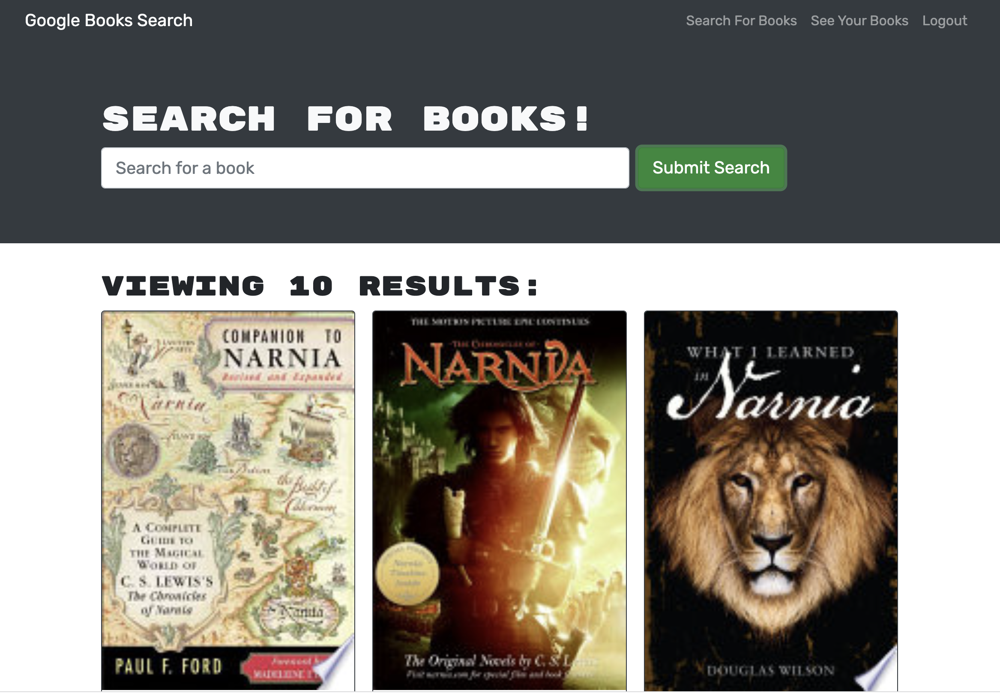

<h1>Book Search Engine👋</h1>

## Description:

This application allows users to search for new books from Google's Book API. Users can log in to save the book they would like to purchase, as well as to remove the books from their library.

## Table of Contents

- [Description](#description)
- [Deployment](#application-deployment)
- [Technology](#Technology)
- [Installation](#installation)
- [Usage](#usage)
- [License](#license)
- [Contribution](#contribution)
- [Questions](#questions)


## Application Deployment
[https://xiaojing-deng.herokuapp.com/](https://xiaojing-deng.herokuapp.com/)

## Application Screenshot




https://user-images.githubusercontent.com/110792983/214473363-37a2fb83-8e54-4788-95d8-7b7387032a07.mp4


## Technology:

Project is created with:

- MongoDB
- Express.js
- React.js
- Node.js
- JavaScript
- GraphQL API
- Apollo Server

## Installation

To run this project, install it locally using npm:

```
npm install
```

## Usage

After installing npm packages, the application will be invoked by using the following command:

```
npm run develop
```


## Contributing
👥 Xiaojing Deng


## License

</br>
<p>Permission to use this application is granted under the MIT license.</p>
 
[MIT](https://choosealicense.com/licenses/mit)


## Questions
✋Reach me here:<br/>
:octocat: Find me on GitHub: [xiaojing168jmg168](https://github.com/xiaojing168jmg168)<br/>
📩 Email me with any questions: 8redfishcreative@gmail.com
